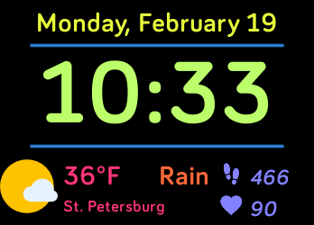

# TimeDateWeather
Super basic date + time + weather (and day's forecast) + steps + hr. No fuss.
[Open weather map api](https://openweathermap.org/api).

Today's forecast is in orange- will be either "Rain", "Snow", "Clouds", or
"Clear", summarizing the day's forecast.

*Note: if weather data doesn't update after installing, go to the clockface's
settings and select either "Celsius" or "Fahrenheit", which will force a weather
refresh*

# Attribution
## Icons
Icons courtesy of:

Icons made by <a href="https://www.flaticon.com/authors/roundicons" title="Roundicons">Roundicons</a> from <a href="https://www.flaticon.com/" title="Flaticon">www.flaticon.com</a> is licensed by <a href="http://creativecommons.org/licenses/by/3.0/" title="Creative Commons BY 3.0" target="_blank">CC 3.0 BY</a>

Icons made by <a href="https://www.flaticon.com/authors/google" title="Google">Google</a> from <a href="https://www.flaticon.com/" title="Flaticon">www.flaticon.com</a> is licensed by <a href="http://creativecommons.org/licenses/by/3.0/" title="Creative Commons BY 3.0" target="_blank">CC 3.0 BY</a>

## Weather
Weather module courtesy of:
https://github.com/gregoiresage/fitbit-weather

# License
No license, do whatever you want!
